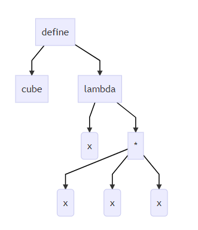

## Section 5

### 5.1 Racket Definitions Functions Conditionals


```scheme
(define x 3) ; val x = 3
(define y (+ x 2)) ; + is a function, call it here

(define cube1 
  (lambda (x)
    (* x (* x x)))) ; x * ( x * x )

(define cube2
  (lambda (x)
    (* x x x))) ; * can take multiple argument

(define (cube3 x)
  (* x x x))	; syntactic sugar. The same thing as cube2 

(define (pow1 x y) ; x to the yth power (y must be nonegative)
	(if (= y 0)
        1
        (* x (pow1 x (- y 1)))))

(define pow2		; the currying version of pow
  (lambda (x)		; but the use of pow2 is different
    (lambda (y)		; (define sixteen ((pow2 4) 2)) -> sixteen = 16
      (pow1 x y))))

(define three-to-the (pow2 3))	; (three-to-the 2)	evaluate to 9
```
### 5.2 Racket Lists

- Empty list:  `null`
- Cons constructor:  `cons`
- Access head of list: `car`
- Access tail of list: `cdr`
- Check for empty: `null?`

##### Notes:

- unlike Scheme, `()`doesn't work for `null`, but `'()` dose
- `(list e1 ... en)` for building lists
- Names `car` and `cdr` are a historical accident

```scheme
; list processing: null, cons, null?, car, cdr
; we won't use pattern-matching in Racket

; sum all the numbers in a list
(define (sum xs)	; (sum (list 3 4 5 6 ))
  (if (null? xs)
      0
      (+ (car xs) (sum (cdr xs)))))

; append
(define (my-append xs ys)
  (if (null? xs)
      ys
      (cons (car xs) (my-append (cdr xs)))))

;map
(define (my-map f xs)		;(define foo (my-map (lambda (x) (+ x 1))(list 2 3 4)))
  (if (null? xs)			; foo = '(3 4 5)
      null
      (cons (f (car xs)) 
            (my-map f (cdr xs)))))
```

### 5.3 Syntax and Parentheses

A term (anything in the language) is either:

- An atom, e.g. , `#t`, `#f`, `34`, `"hi"`, `null`, `4.0`, `x`, ...
- A especial form, e.g., `define`, `lambda`, `if`
  - Macros will let us define our own
- A sequence of terms in parentheses: `(t1 t2 ... tn)`
  - If `t1` a special form, semantics of sequence is special
  - Else a function call


- Example: `(+ 3 (car xs))`
- Example: `(lambda (x) (if x "hi" #t))`

##### Brackets

Minor note:

- Can use `[` anywhere you use `(`, but must match with `]`
  - Will see shortly places where `[...]` is common style
  - DrRacket lets you type `)` and replaces it with `]` to match

##### Why is this good?

By parenthesizing everything, converting the program text into a tree representing the program (parsing) is trivial and unambiguous

- Atoms are leaves
- Sequences are nodes with elements as children
- (No other rules)

Also makes indentation easy

Example:

```scheme
(define cube 
  (lambda (X)
    (* x x x)))
```



No need to discuss "operator precedence"  like `(x + y * z)`

### 5.4 Parentheses Matter Debugging Practice

##### Parentheses matter

You must break yourself of one habit for Racket:

- Do not add/remove parens because you feel like it
  - parens are never optional or meaningless
- In most places `(e)` means call `e` with zero arguments
- So `((e))` means call `e` with zero arguments and call the result with zero arguments

Without static typing, often get hard-to-diagnose run-time errors

```scheme
; right version. (fact 5) -> 120
(define (fact n) (if (= n 0) 1 (* n (fact (- n 1)))))	

; error: call 1 with no arguments.
(define (fact1 n) (if (= n 0) (1) (* n (fact1 (- n 1))))) 

; only not work when call  (fact1b 0)
(define (fact1b n) (if (= n 0) (1) (* n (fact (- n 1))))) 

; bad syntax: if has 5 parts after keyword
(define (fact2 n) (if = n 0 1 (* n (fact2 (- n 1)))))

; bad syntax: multiple expressions after identifier
(define fact3 (n) (if (= n 0) 1 (* n (fact (- n 1)))))

; error:   *: unexpected type as 2nd argument
(define (fact4 n) (if (= n 0) 1 (* n fact4 (- n 1))))	

; procedure fact5: expects 1 argument, given 0
(define fact5 (n) (if (= n 0) 1 (* n ((fact5) (- n 1)))))
```


### 5.5 Dynamic Typing

##### Dynamic typing

Major topic coming later: contrasting static typing (e.g. ML)  with dynamic typing (e.g. Racket)

For now:

- Frustrating not to catch "little errors" like `(n * x)` until you test your function
- But can use very flexible data structures and code without convincing a type checker that it makes sense

Example:

- A list can contain numbers or other lists
- Assuming lists or numbers "all the way down" sum all the numbers...

```scheme
(define xs (list 4 5 6))
(define ys (list (list 4 5) 6 7 (list 8) 9 2 3 (list 0 1)))
(define zs (list #f "hi" 14))


(define (sum1 xs)		; sum a list which only hold all inside element is int
  (if (null? xs)
      0
      (if (number? (car xs))
          (+ (car xs) (sum1 (cdr xs)))
          (+ (sum1 (car xs)) (sum1 (cdr xs))))))

(define (sum2 xs)		; skip the val which isn't number
  (if (null? xs)
      0
      (if (number? (car xs))
          (+ (car xs) (sum2 (cdr xs)))
          (if (list? (car xs))
              (+ (sum2 (car xs)) (sum2 (cdr xs)))
                 (sum2 (cdr xs))))))
```


### 5.6 Cond

##### Better style

Avoid nested if-expressions when you can use cond-expressions instead

- Can think of one as sugar for the other

General syntax:

```scheme
(cond [e1a e1b]
      [e2a e2b]
      ...
      [eNa eNb])
```

- Good style: `eNa` should be `#t`

```scheme
(define (sum2 xs)		; rewrite of sum2 in Section 5.7 with cons
  (cond [(null? xs) 0]
        [(number? (car xs)) (+ (car xs) (sum3 (cdr xs)))]
        [#t (+ (sum3 (car xs)) (sum3 (cdr xs)))]))

(define (sum3 xs)		; rewrite of sum3 in Section 5.7 with cons	
  (cond [(null? xs) 0]
        [(number? (car xs)) (+ (car xs) (sum3 (cdr xs)))]
        [(list? (car xs)) (+ (sum3 (car xs)) (sum3 (cdr xs)))]
        [#t (sum4 (cdr xs)]))
```

##### What is true?

For both `if` and `cond` , test expression can evaluate to anything

- It is not an error if the result is not `#t` or `#f`
- (Apologies for the double-negative :) )

Semantics of `if` and `cond`:

- "Treat anything other than `#f` as true"
- (In some languages, other things are false, not in Racket)

This feature makes no sense in a statically typed language

Some consider using this feature poor style, but it can be convenient

```scheme
(if 34 14 15)   ; evaluate to 14
(if null 14 15) ; evaluate to 14
(if #f 14 15)   ; evaluate to 15
```

```scheme
(define (count-falses xs)
  (cond [(null? xs) 0]
        [(car xs) (count-falses (cdr xs))]	 ; (car xs) can have any other than false
        [#t (+ 1 (count-falses (cdr xs)))])) ; the only thing left is #f
```

### 5.7 Local Bindings

```scheme
(define (max-of-list xs)	; an example of let expression
  (cond [(null? xs) (error "max-of-list given empty list")]
        [(null? (cdr xs)) (car xs)]
        [#t (let ([tlans (max-o-list (cdr xs))])
              (if (> tlans (car xs))
                  tlans
                  (car xs)))]))
```

##### Local bindings

- Racket has 4 ways to define local variables
  - `let`
  - `let*`
  - `letrec`
  - `define`
- Variety is good: They have different semantics
  - Use the one most convenient for your needs, which helps communicate your intent to people reading your code
    - If any will work, use `let`
  - Will help us better learn scope and environments
- Like in ML, the 3 kind of let-expressions can appear anywhere

##### Let

A let expression can bind any number of local variables

- Notice where all the parentheses are

The expressions are all evaluated in the environment from **before the let-expression**

- Except the body can use all the local variables of course
- This is **not** how ML let-expressions work
- Convenient for things like `(let ([x y] [y x]) ...)`

```scheme
(define (silly-double x)	; a silly example of let expression 
  (let ([x (+ x 3)]			; x binding to the outer x
        [y (+ x 2)])		; y binding to the outer x
    (+ x y -5)))
```

##### Let*

Syntactically, a `let*` expression is a let-expression with 1 more character

The expressions are evaluated in the environment produced from the `previous bindings`

- Can repeat bindings (later ones shadow)
- This **is** how ML let-expressions work

```scheme
(define (silly-double x)
  (let* ([x (+ x 3)]		; x binding to the outer x
         [y (+ x 2)])		; y binding to the inner x
    (+ x y -8)))
```

##### Letrec

Syntactically, a letrec expression is also the same

The expressions are evaluated in the environment that includes **all the bindings**

```scheme
(define (silly-triple x)
  (letrec ([y (+ x 2)]
           [f (lambda(z) (+ z y w x))]
           [w (+ x 7)])
    (f -9)))
```

- Needed for mutual recursion
- But expressions are still evaluated in order: accessing an uninitialized binding would produce an error
  - Remember function bodies not evaluated until called

##### More letrec

- Letrec is ideal for recursion (including mutual recursion)

  ```scheme
  (define (silly-mod2 x)
    (letrec
      ([even? (lambda(x) (if (zero? x) #t (odd? (- x 1))))]
       [odd? (lambda(x) (if (zero? x) #f (even? (- x 1))))])
      (if (even? x) 0 1)))
  ```

- Do not use later bindings except inside functions

  - This example will raise an error when called

    ```scheme
    (define (bad-letrec x)
      (letrec ([y z]
               [z 13])
         (if x y z)))
    ```

##### Local defines

- In certain positions, like the beginning of function bodies, you can put defines

  - For defining local variables, same semantics as `letrec`

  ```scheme
  (define (silly-mod2 x)
    (define (even? x) (if (zero? x) #t (odd? (- x 1))))
    (define (odd? x) (if (zero? x) #f (even? (- x 1))))
    (if (even? x) 0 1))
  ```

- Local defines is preferred Racket style, but course materials will avoid them to emphasize `let`, `let*`, `letrec` distinction

  - You can choose to use them on homework or not

### 5.8 Toplevel Bindings

##### Top-level

The bindings in a file work like local defines, i.e., `letrec`

- Like ML, you can refer to earlier bindings
- Unlike ML, you can also refer to later bindings
- But refer to later bindings only in function bodies
  - Because bindings are evaluated in order
  - An error to use an undefined variable
- Unlike ML, cannot define the same variable twice in module
  - Would make no sense: cannot ave both in environment

```scheme
(define (f x) (+ x (* x b)))	; forward reference okey here
(define b 3)
(define c (+ b 4))				;backward reference okey
;(define d (+e 4))	; not okay (get an erro instead of #<undefined>)
(define e 5)
;(define f 17)	; not okay: f already defined in this module
```

##### REPL

Unfortunate detail:

- REPL works slightly differently

  - Not quite `let*` or `letrec`
  - :(

- Best to avoid recursive function definitions or forward references in REPL

  - Actually okay unless shadowing something (you may not know about) - then weirdness ensues

  - And calling recursive functions is fine of course

##### Actually...

- Will study Racket's module system in next section
  - Each file is implicitly a module
    - Not really "top-level"
  - A module can shadow bindings from other modules it uses
    - Including Racket standard library
  - So we could redefine `+` or any other function
    - But poor style
    - Only shadows in our module (else messes up rest of standard library)
- Scheme is different

### 5.9 mutation with `set!`

##### Set!

- Unlike ML, Racket really has assignment statements

  - But used *only-when-really-appropriate*

  ```scheme
  (set! x e)
  ```

- For the `x` in the current environment, subsequent lookups of `x` get the result of evaluating expression `e`

  - Any code using this `x` will be affected
  - Like `x = e` in Java, C, Python, etc.

- Once you have side-effects, sequences are useful:

  ```scheme
  (begin e1 e2 ... en)
  ```

##### Example

Example uses `set!` at top-level; mutating local variables is similar

```scheme
(define b 3)
(define f (lambda (x) (* 1 (+ x b))))
(define c (+ b 4))	; 7
(set! b 5)
(define z (f 4))	; 9
(define w c)		; 7
```

Not much new here:

- Environment for closure determined when function is defined, but body is evaluated when function is called
- Once an expression produces a value, it is irrelevant how the value was produced

##### Top-level

- Mutating top-level definitions is particularly problematic

  - What if any code could do `set!` on anything?
  - How could we defend against this?

- A general principle: If something you need not to change might change, make a local of it. Example:

  ```scheme
  (define b 3)
  (define f
    (let ([b b])
      (lambda (x) (* 1 (+ x b)))))
  ```

Could use a different name for local copy but do not need to

##### But wait...

- Simple elegant language design:

  - Primitives like `+` and `*` are just predefined variables bound to functions

  - But maybe that means they are mutable

  - Example continued:

    ```scheme
    (define f
      (let ([b b]
            [+ +]
            [* *](
            (lambda (x) (* 1 (+ x b))))))
    ```

  - Even that won't work if `f` uses other functions that use things that might get mutated - all functions would need to copy everything mutable they used

##### Not such madness

In Racket, you do not have to program like this

- Each file is a module
- If a module does not use `set!` on a top-level variable, then Racket makes it constant and forbids `set!` outside the module
- Primitives like `+`, `*`, and `cons` are in a module that does not mutate them

Showed you this for the *concept* of copying to defend against mutation

- Easier defense: Do not allow mutation
- Mutable top-level bindings a highly dubious idea

### 5.10 The Truth About Cons

`cons` just makes a pair

- Often just makes a pair
- By convention and standard library, lists are nested pairs that eventually end with `null`

```scheme
(define pr (cons 1 (cons #t "hi")))	; '(1 #t . "hi")	like (1, (true, "hi")) in ML
(define lst (cons 1 (cons #t (cons "hi" null))))	; '(1 #t "hi") does make a list
(define hi (cdr (cdr pr)))	; "hi"
(define hi2 (cdr (cdr lis)))	; '("hi")	a list
(define hi-again (car (cdr (cdr lst))))	; "hi"
(define hi-another (caddr lst))	; "hi"
(define no (list? pr))
(define yes (pair? pr))
(define of-course (and (list? lst) (pair? lst)))	; #t
```

Passing an improper list to functions like `length` is a run-time error

So why allow improper lists?

- Pairs are useful
- Without static types, why distinguish `(e1, e2)` and `e1 :: e2`

Style:

- Use proper lists for collections of unknown size
- But feel free to use `cons` to build a pair
  - Though structs (like records) may be better

Built-in primitives:

- `list?` returns true for proper lists, including the empty list
- `pair?` returns true for things made by cons
  - All improper and proper lists except the empty list

### 5.11 mcons For Mutable Pairs

##### cons cells are immutable

What if you wanted to mutate the contents of a cons cell?

- In Racket you cannot (major charge for Scheme)
- This is good
  - List-aliasing irrelevant
  - Implementation can make `list?` fast since listness is determined when cons cell is created

##### set! does not change list contents

This does not mutate the contents of a cons cell:

```scheme
(define x (cons 14 null))   ; x -> '(14)
(define y x)				; y -> '(14)
(set! x (cons 42 null))		; x -> '(42)	but did not change y -> '(14)
(car y)	; 14
(car x) ; 42
;(set! (car x) 45)	;set!: not an dentifier in: (car x) 
```

- Like Java's `x = new Cons(42, null)`, not `x.car = 42`

##### mcons cells are mutable

```scheme
(define mpr (mcons 1 (mcons #t "hi")))	; mpr -> (mcons 1 (mcons #t "hi"))
;(car mpr)	; car: expects argument of type <pair>
(mcar mpr)	; 1
(mcdr mpr) 	; (mcons #t "hi")
(mcar (mcdr mpr))	; #t
(set-mcdr! mpr 47)	; 47	mpr -> (mcons 1 47)
(set-mcdr! mpr (mcons #t "hi"))	;	mpr -> (mcons 1 (mcons #t "hi"))
(set-mcar! (mcdr mpr) 14)	; mpr -> (mcons 1 (mcons 14 "hi"))
(length (cons 2 (cons 3 null)))	; 2
;(length (cons 2 (cons 3 4)))	; error
;(length (mcons 2 (mcons 3 null)))	; error
```

Since mutable pairs are somethings useful (will use them soon), Packet provides them too:

- `mcons`
- `mcar`
- `mcdr`
- `mpair?`
- `set-mcar!`
- `set-mcdr!`

Run-time error to use `mcar` on a cons cell or `car` on an mcons cell

### 5.12 Delayed Evaluation and Thunks

##### Delayed evaluation

For each language construct, the semantics specifies when subexpressions get evaluated. In ML, Racket, Java, C:

- Function arguments are eager (call-by-value)
  - Evaluation once before calling the function
- Conditional branches are not eager

It matters: calling `factorial-bad` never terminates:

```scheme
(define (factorial-normal x)
  (if (= x 0)
      1
      (* x (factorial-normal (- x 1)))))

(define (my-if-bad x y z)
  (if x y z))

(define (factorial-bad n)
  (my-if-bad (= n 0)
             1
             (* n (factorial-bad (- n 1)))))
```

##### Thunks delay

We know how to delay evaluation: put expression in a function!

- Thanks to closures, can use all the same variables later

A zero-argument function used to delay evaluation is called a thunk

- As a verb: thunk the expression

This works (but it is silly to warp `if` like this):

```scheme
; e2 and e3 should be zero-argument functions (delays evaluation)
(define (my-if-strange-but-works e1 e2 e3)
  (if e1 (e2) (e3)))	; (e)

(define (factorial-okay x)
  (my-if-strange-but-works 
   (= x 0)
   (lambda() 1)
   (lambda() (* n (fact (- n 1))))))
```

##### The key point

- Evaluate an expression `e` to get a result:

  ```scheme
  e
  ```

- A function that when called, evaluates `e` and returns result

  - Zero-argument function for "thunking"

    ```scheme
    (lambda() e)
    ```

- Evaluate `e` to some thunk and then call the thunk

  ```sch
  (e)
  ```

- Next: Powerful idioms related to delaying evaluation and/or avoided repeated or unnecessary computations

  - Some idioms also use mutation in encapsulated ways

### 5.13 Avoiding Unnecessary Computations

##### Avoiding expensive computations

Thunks let you skip expensive computations if they are not needed

Great if take the true-branch:

```scheme
(define (f th)
  (if (...) 0 (... (th) ...)))
```

But worse if you end up using the thunk more than once:

```scheme
(define (f th)
  (... (if (...) 0 (... (th) ...))
       (if (...) 0 (... (th) ...))
       ...
       (if (...) 0 (... (th) ...))))
```

In general, might not know many times a result is needed

```scheme
; this is a silly addition function that purposely runs slows for
; demonstration puroises
(define (slow-add x y)
  (letrec ([slow-id (lambda (y z)
                      (if (= 0 z)
                          y
                          (slow-id y (- z 1))))])
    (+ (slow-id x 50000000) y)))

;multiplies x and result of y-thunk, calling y-thunk x times
(define (my-mult x y-thunk)	;; assumes x is >= 0
  (cond [(= x 0) 0]
        [(= x 1) (y-thunk)]
        [#t (+ (y-thunk) (my-mult (- x 1) y-thunk))]))
```

##### Best of both worlds

Assuming some expensive computation has no side effects, ideally we would:

- Not compute it until needed
- Remember the answer so future uses complete immediately

Called lazy evaluation

Languages where most constructs, including function arguments, work this way are lazy languages

- Haskell

Racket predefines support for promises, but we can make our own

- Thunks and mutable pairs are enough

### 5.14 Delay and Force

##### Delay and Force

```scheme
(define (my-delay th)
  (mcons #f th))

(define (my-force p)
  (if (mcar p)
      (mcdr p)
      (begin (set-macr! p #t)
             (set-mcdr! p ((mcdr p)))
             (mcdr p))))
```

An ADT represented by a mutable pair

- `#f` in car means `cdr` is unevaluated thunk
  - Really a one-of type: thunk or result-of-thunk
- Ideally hide representation in a module

##### Using promises

```scheme
(define (f p)
  (... (if (...) 0 (... (my-force p) ...))
       (if (...) 0 (... (my-force p) ...))
       ...
       (if (...) 0 (... (my-force p) ...))))

(f (my-delay (lambda () e)))
```

##### Lessons From Example

See code file for example that does multiplication using a very slow addition helper function

- With thunking second argument:
  - Great if first argument 0
  - Okay if first argument 1
  - Worse otherwise
- With precomputing second argument:
  - Okay in all cases

- With thunk that uses a promise for second argument:
  - Great if first argument 0
  - Okay otherwise

### 5.15 Using Streams

##### Steams

- A stream is an infinite sequence of values
  - So cannot make a stream by making all the values
  - Key idea: Use a thunk to delay creating most of the sequence
  - Just a programming idiom
- A powerful concept for division of labor:
  - Stream producer knows how create any number of values
  - Stream consumer decides how many values to ask for
- Some examples of streams you might (not) be familiar with:
  - User actions (mouse clicks, etc.)
  - UNIX pipes: `cmd1 | cmd2` has `cmd2` "pull" data from `cmd1`
  - Output values from a sequential feedback circuit

##### Using streams

We will represent streams using pairs and thunks

Let a stream be a thunk that when called returns a pair:

```scheme
'(next-answer . next-thunk)
```

So given a stream `s`, the client can get any number of elements

- First: `(car (s))`

- Second: `(car ((cdr (s))))`

- Third: `car ((cdr ((cdr (s)))))`

  (Usually bind `(cdr (s))` to a variable or pass to a recursive function)

```scheme
; powers-of-two is a streams contain the sequence: 2 4 8 16 ...
powers-of-two ; #<procedure: powers-of-two>
(car (powers-of-two))	; 2
(car ((cdr (powers-of-two))))	; 4
(car ((cdr ((cdr (powers-of-two))))))	; 8
```

##### Example using streams

This function returns how many stream elements it takes to find one for which tester does not return `#f`

- Happens to be written with a tail-recursive helper function

```scheme
(define (number-until stream tester)
  (letrec ([f (lambda (stream ans)
                (let ([pr (stream)])
                  (if (tester (car pr))
                      ans
                      (f (cdr pr) (+ ans 1)))))])
    (f stream 1)))
```

- `(stream)` generates the pair
- So recursively pass `(cdr pr)`, the thunk for the rest of the infinite sequence

### 5.16 Defining Streams

##### Streams

Coding up a stream in your program is easy

- We will do functional streams using pairs and thunks

Let a stream be a thunk that when called returns a pair:

```scheme
'(next-answer . next-thunk)
```

Saw how to use them, now how to make them...

- Admittedly mind-bending, but uses what we know

##### Making streams

- How can one thunk create the right next thunk? Recursion!
  - Make a thunk that produces a pair where `cdr` is next thunk
  - A recursive function can return a thunk where recursive call dose not happen until thunk is called

```scheme
; 1 1 1 1 1 ...
(define ones (lambda() (cons 1 ones)))

; 1 2 3 4 5 ...
(define nats
  (letrec ([f (lambda (x)
                (cons x (lambda () (f (+ x 1)))))])
    (lambda () (f 1))))

; 2 4 8 16 ...
(define powers-of-two
  (letrec ([f (lambda (x)
                (cons x (lambda () (f (* x 2)))))])
    (lambda () (f 2))))
```

##### Getting it wrong

```scheme
; this uses a variable before it is defined
(define ones-really-bad (cons 1 ones-really-bad))

; this goes into an infinite loop making an infinite-length list
(define ones-bad (lambda () cons 1 (ones-bad)))
(define (ones-bad) (cons 1 (ones-bad)))

; this is a stream: thunk that returns a pair with cdr a thunk
(define ones (lambda () (cons 1 ones)))
(define (ones) (cons 1 ones))
```

### 5.17 Memoization